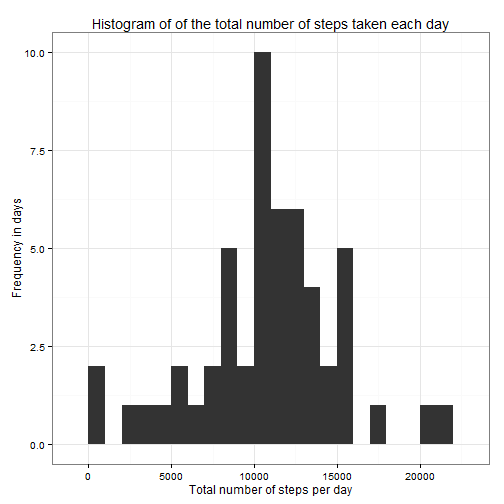
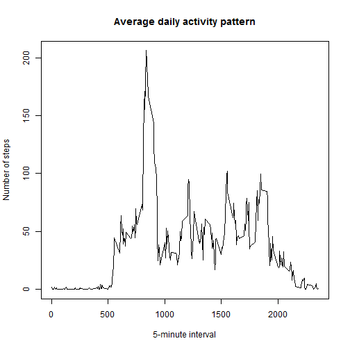
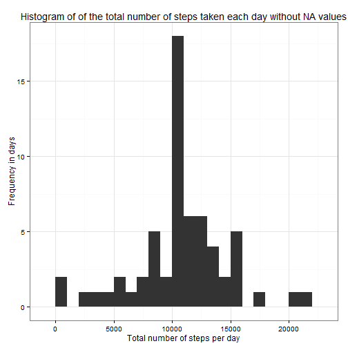
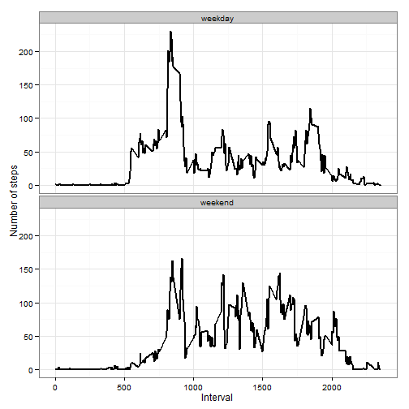

### Introduction

We load if needed all the libraries for the assignment.
For this, we use the require() function.

```r
## Loading the libraries if needed
require(knitr)
require(ggplot2)
```

```
## Loading required package: ggplot2
## Need help? Try the ggplot2 mailing list: http://groups.google.com/group/ggplot2.
```

```r
require(plyr)
```

```
## Loading required package: plyr
```

For non-English environments (like mine which is in French), change the default
language to English, especially for dates.

```r
Sys.setlocale("LC_TIME", "English") #to use on Windows environment
```

```
## [1] "English_United States.1252"
```

```r
## for other environments, try rather Sys.setlocale("LC_TIME", "C")
```

For the whole document, we set the options as echo = TRUE and results = hold

```r
opts_chunk$set(echo = TRUE, results="hold") #setting option for knitr
options(scipen = 4, digits = 2) #setting options for display of numbers
```

Before loading the data, you should check if the working directory is in the right location. It should be in the directory where you've cloned the "RepData_PeerAssessment1" github directory.
Use the function setwd() for setting the right working directory.

### Loading and preprocessing the data

```r
## Load the data
unzip("activity.zip") # unzip file
# load data in variable called activity
activity <- read.csv("activity.csv", colClasses=c("numeric","character","numeric"))

## Preprocess the data
activity$date <- as.Date(activity$date,format="%Y-%m-%d") #putting in date format
```
### What is mean total number of steps taken per day?

For this part of the assignment, you can ignore the missing values in the dataset.

- Make a histogram of the total number of steps taken each day

```r
## Sum the steps for each day
stepsEachDay <- aggregate(steps ~ date, activity, sum)

## Plot a histogram of the total number of steps taken each day
ggplot(stepsEachDay, aes(x = steps)) + 
       geom_histogram(binwidth = 1000) + 
        labs(title="Histogram of of the total number of steps taken each day", 
             x = "Total number of steps per day", y = "Frequency in days") + 
        theme_bw()
```

 

- Calculate and report the mean and median total number of steps taken per day

```r
mean_steps <- mean(stepsEachDay$steps,na.rm=TRUE) #mean per day
median_steps <- median(stepsEachDay$steps,na.rm=TRUE) #median per day
```

The mean total number of steps taken per day is **10766.19**.

The median total number of steps taken per day is **10765**.

### What is the average daily activity pattern?

- Make a time series plot (i.e. type = "l") of the 5-minute interval (x-axis) and the average number of steps taken, averaged across all days (y-axis)

```r
stepsPerInterval <- aggregate(steps ~ interval, activity, mean) #mean per interval
plot(stepsPerInterval$interval,stepsPerInterval$steps,type="l",main="Average daily activity pattern", xlab="5-minute interval", ylab="Number of steps")
```

 

- Which 5-minute interval, on average across all the days in the dataset, contains the maximum number of steps?

```r
maxAvgInterval <- stepsPerInterval[which.max(stepsPerInterval$steps),"interval"]
```
The 5-minute interval, which contains the maximum number of steps on average across all the days in the dataset, is the **835th** interval.

### Imputing missing values

Note that there are a number of days/intervals where there are missing values (coded as NA). The presence of missing days may introduce bias into some calculations or summaries of the data.

- Calculate and report the total number of missing values in the dataset (i.e. the total number of rows with NAs)

```r
naNumber <- sum(is.na(activity$steps))
```
The total number of missing values in the dataset is **2304**.

- Devise a strategy for filling in all of the missing values in the dataset. The strategy does not need to be sophisticated. For example, you could use the mean/median for that day, or the mean for that 5-minute interval, etc.

Here, I'll fill the missing values with the average value for the corresponding interval across all the days.

```r
# Calculate the row numbers where there is a NA value
naRow <- which(is.na(activity$steps))
# Get the average value for the corresponding interval
naValues <- stepsPerInterval[match(activity[naRow,3],stepsPerInterval$interval),"steps"]
```

- Create a new dataset that is equal to the original dataset but with the missing data filled in.

```r
# Create a new dataset equal to activity
activityFull <- activity
# Replace the NA values in the activityFull dataset
activityFull[naRow,"steps"] <- naValues
```

- Make a histogram of the total number of steps taken each day and Calculate and report the mean and median total number of steps taken per day. Do these values differ from the estimates from the first part of the assignment? What is the impact of imputing missing data on the estimates of the total daily number of steps?

First, I make a histogram of the total number of steps taken each day with the new dataset.

```r
## Re-sum the steps for each day
stepsEachDayFull <- aggregate(steps ~ date, activityFull, sum)

## Plot a histogram of the total number of steps taken each day without NA values
ggplot(stepsEachDayFull, aes(x = steps)) + 
       geom_histogram(binwidth = 1000) + 
        labs(title="Histogram of of the total number of steps taken each day without NA values", 
             x = "Total number of steps per day", y = "Frequency in days") + 
        theme_bw()
```

 

Then, I calculate the new mean and median total number of steps taken per day.

```r
mean_steps_full <- mean(stepsEachDayFull$steps,na.rm=TRUE) #mean per day
median_steps_full <- median(stepsEachDayFull$steps,na.rm=TRUE) #median per day
```
The mean total number of steps taken per day is **10766.19** for the dataset without NA value. It was previously (i.e. with the NA values) **10766.19**.

The median total number of steps taken per day is **10766.19** for the dataset without NA value. It was previously (i.e. with the NA values) **10765**.

The impact of of imputing missing data on the estimates of the total daily number of steps has changed the median value : it is now equal to the mean value.
However the mean value has not changed.

The other visible change is on the frequency of the average total number of steps in the histogram : it has increased from 10 to 17.5 in the second histogram.

### Are there differences in activity patterns between weekdays and weekends?

For this part the weekdays() function may be of some help here. Use the dataset with the filled-in missing values for this part.

- Create a new factor variable in the dataset with two levels -- "weekday" and "weekend" indicating whether a given date is a weekday or weekend day.

```r
## Create the weekday column by transforming date with weekdays() function
activityFull <- mutate(activityFull,weekday = weekdays(date))

## Transform weekdays in either "weekday"" or "weekend"" values
activityFull$weekday <- ifelse(activityFull$weekday %in% c("Saturday","Sunday"),"weekend","weekday")

## Factorize the new variable weekday
activityFull$weekday <- as.factor(activityFull$weekday)
```

- Make a panel plot containing a time series plot (i.e. type = "l") of the 5-minute interval (x-axis) and the average number of steps taken, averaged across all weekday days or weekend days (y-axis).

```r
## Calculate the the average number of steps across all days by interval and weekday
weekStep <- aggregate(steps ~ interval+weekday, activityFull, mean)

## Create the required plot
ggplot(weekStep, aes(x=interval, y=steps)) + 
        geom_line(size=1) + 
        facet_wrap(~ weekday, nrow=2, ncol=1) +
        labs(x="Interval", y="Number of steps") +
        theme_bw()
```

 

By comparing the two plots, we can see that the activity peaks in the morning during weekdays. 
Whereas during week-ends, there are several peaks during daytime.
For both week-end and week-days, the activity is almost null during the night.
